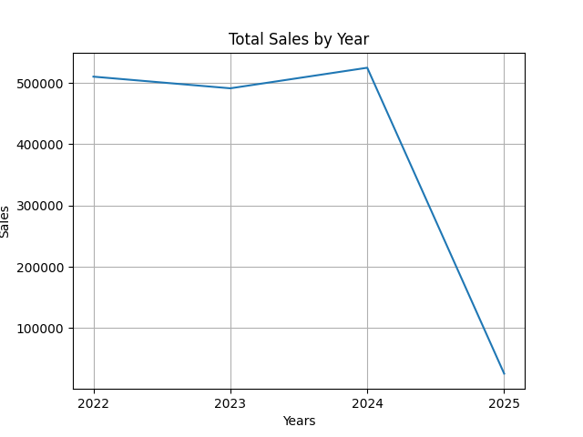
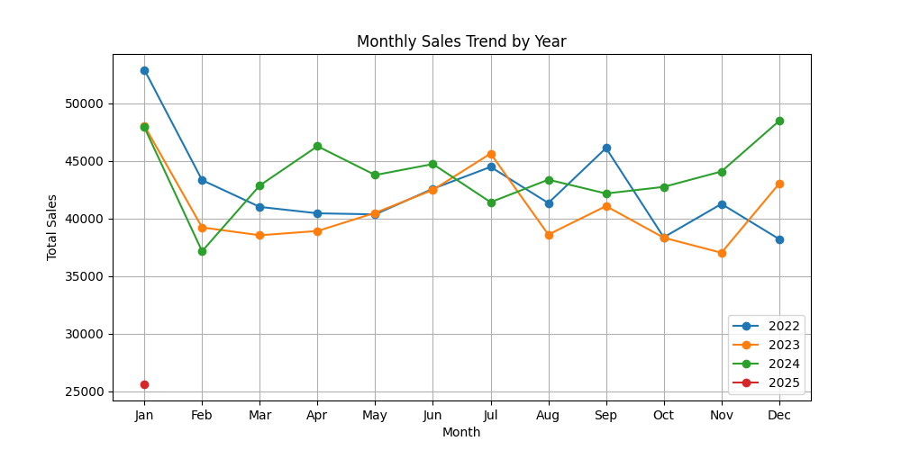
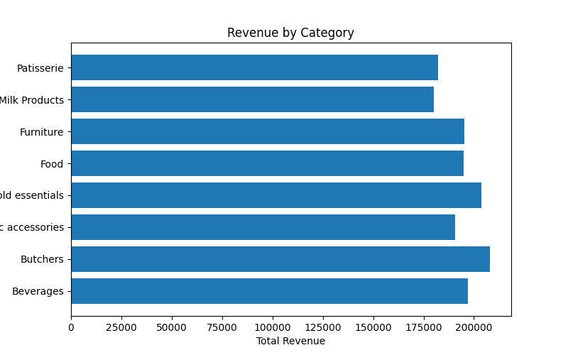
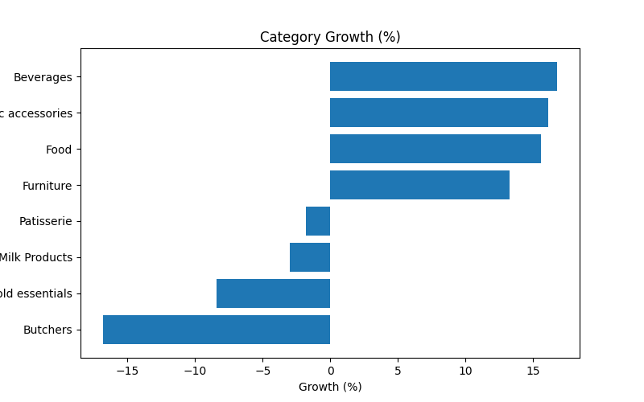
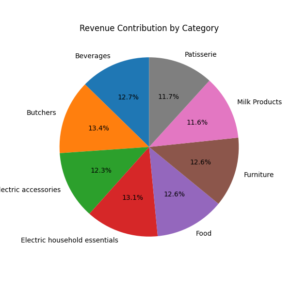

## Exploratory Data Analysis on Retail Store Sales Dataset

##  Project Overview
This project analyzes retail sales transactions.The data was cleaned before analysis which aimed to determine sales patterns,customer purchasing behaviour and product perfomance.  

##  Analysis Objectives
*The analysis focused on:
* Clean inconsistent and missing data.
* Identifyng sales trend over time.
* Compare performance of different product categories.
* Examine customer purchasing behaviour.
* Compare revenue acrsoss sales channels

##  Dataset
**Source:** Retail Store Sales Dataset

##  Tools and Technologies
**Programming Language:** Python

**Libraries Used:**
* pandas
* NumPy
* Matplotlib

##  Key Steps

### Data Loading and inspection
* Imported the dataset using pandas.
* Explored the dataset using `.info()`, `.describe()` and other inspection methods.
* Identified duplicate records and missing values.

### Data Cleaning

* Removed duplicate records.
* Handled missing values using mathematical relationships between Quantity, Price Per Unit and Total Spent.
* Imputed missing Price Per Unit values using the average price within each Category and Item combination.
* Removed records with irrecoverable missing values.
* Converted transaction dates into a standard datetime format for time-based analysis.

### Exploratory Analysis
* Analyzed yearly sales trends.
* Examined monthly sales trends across different years.
* Calculated yearly revenue contribution.
* Measured overall revenue growth.
* Evaluated category-wise revenue performance.
* Analyzed category growth over time.
* Examined payment method usage.
* Compared in-store and online transactions.
* Calculated average transaction value.
* Determined revenue contribution by product category.

### Data Visualization
* Line Charts: Yearly sales trends and monthly sales trends.
* Horizontal Bar Charts: Revenue by category and category growth.
* Pie Chart: Revenue contribution by category.

##  Visualizations

### Figure 1: Total Sales by Year

### Figure 2: Monthly Sales Trend by Year

### Figure 3: Revenue by Category

### Figure 4: Category Growth (%)

### Figure 5: Revenue Contribution by Category

###  Key Insights
* Electric products were the highest revenue contributing category whereas milk products had the least share at 11.3%
* Coputer and Electric accessories had the highest growth rate at 16% growth rate from 2022-2024 while buthery products had the highest decline with -14.6% over the same period
* Customer payment methods and purchase channels showed relatively balanced distributions.
* Sales icreased at the rate of 2.82% per annum
* Sales for 2025 were projected to reach 408000
  
##  Conclusion
This project demonstrates an end-to-end data analytics workflow including data cleaning, exploratory data analysis and visualization using Python. The analysis highlights sales patterns, product perfomance and customer purchase behavior.
